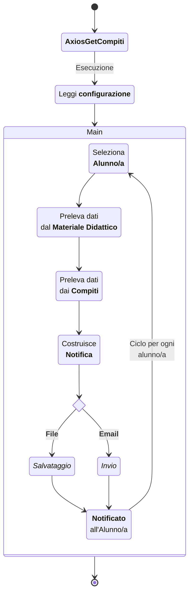
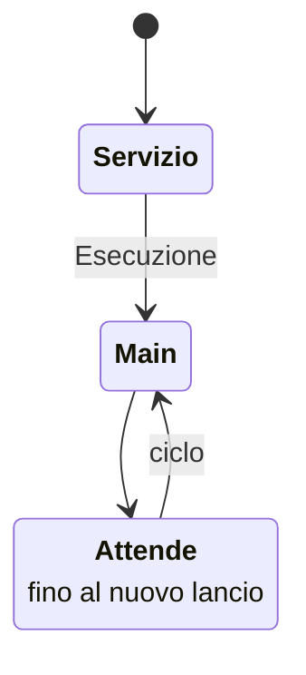

# Funzionamento

Viene illustrato con diagrammi il funzionamento di base di **Axios-Get**, e del servizio di notifica.

## Main Routine

```mermaid
stateDiagram
    MR: Main
    C: Leggi <b>configurazione</b>
    AGC: <b>AxiosGetCompiti</b>
    SAlunno: Seleziona<br><b>Alunno/a</b>
    GMD: Preleva dati<br>dal <b>Materiale Didattico</b>
    GRF: Preleva dati<br>dai <b>Compiti</b>
    Nfile: <i>Salvataggio</i>
    Nemail: <i>Invio</i>
    BNotifica: Costruisce<br><b>Notifica</b>
    Notificato: <b>Notificato</b><br>all'Alunno/a
    state if_state_notifica <<choice>>

    [*] --> AGC
    AGC --> C : Esecuzione
    C --> MR
    state MR {
        SAlunno --> GMD
        GMD --> GRF
        GRF --> BNotifica
        BNotifica --> if_state_notifica
        if_state_notifica --> Nfile : <b>File</b>
        if_state_notifica --> Nemail : <b>Email</b>

        Nfile --> Notificato
        Nemail --> Notificato

        Notificato --> SAlunno : Ciclo per ogni<br>alunno/a
    }
    MR --> [*]
    
```

## Servizio

```mermaid
stateDiagram
    Start: <b>Servizio</b>
    Sleep: <b>Attende</b><br>fino al nuovo lancio
    MR: <b>Main</b>

    [*] --> Start
    Start --> MR : Esecuzione
    MR --> Sleep
    Sleep --> MR : ciclo
```
